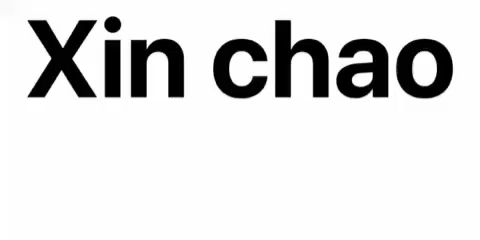

  

<h3 align="center">Hi, I'm A Student At Nguyen Tat Thanh University 😊</h3>

- 🔭 I’m currently working on [AI-Agent](https://github.com/LockMan04/AI-Agent)

- 🌱 I’m currently learning **Deep Learning, Machine Learning**

- 👯 I’m looking to collaborate on [Discord bot](https://github.com/LockMan04/BotDiscord)

- 🤝 I’m looking for help with [My blog](https://github.com/LockMan04/myblog)

- 👨‍💻 All of my projects are available at [https://lockman.dev](https://lockman.dev)

- 📝 I regularly write articles on [Comming soon,...](Comming soon,...)

- 💬 Ask me about **React, CNN, YOLO, Computer Vision**

- 📫 How to reach me **lathanhtoan01@gmail.com**

- ⚡ Fun fact **I think I’m funny, kinda cheeky, and honestly too lazy to update my profile :)))**

<h3 align="left">Connect with me:</h3>

<h3 align="left">Languages and Tools:</h3>

                          

 

    

    

 

 
     

